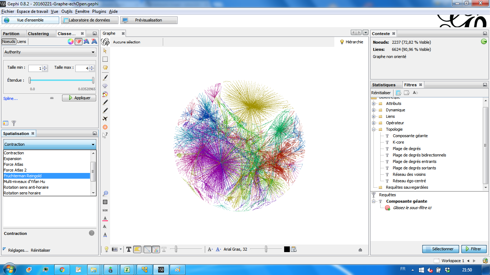
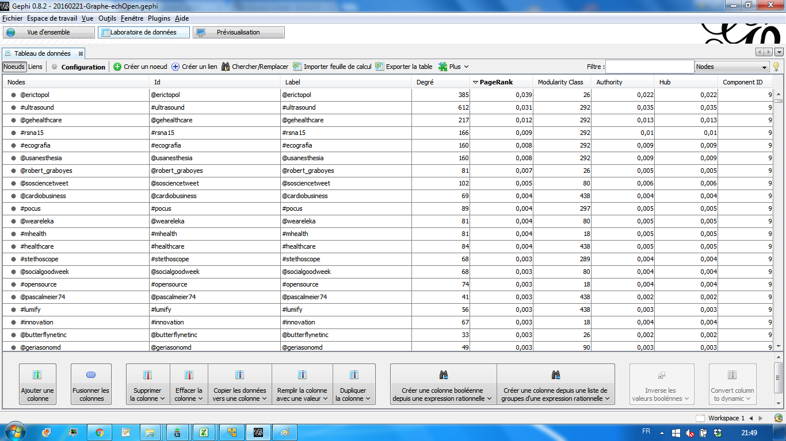
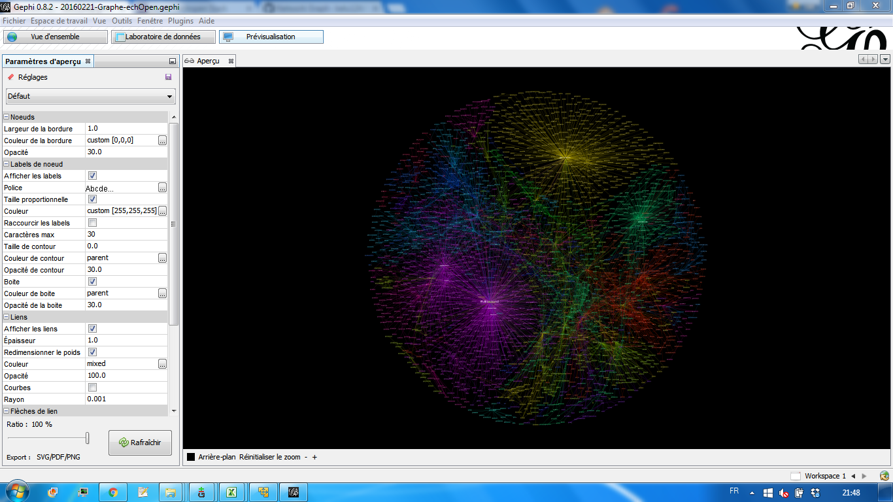

# echOpen processing tweets (ept tool)
## What ?

## Some info

Using the graph. Get all the tweets from gdrive to tsv files (an archive is provided)

> usage : python ept.py tweets.tsv > graph.gdf

Remove all echopenorg mentions? Just 

> sed "/@echopenorg/d" ./graph.gdf > ./graph_clean.gdf

# Outputs

* **20160221-Graphe-echOpen.gephi** is the gephi file.. you can directly open it with Gephi.
* **20160221-Graphe-echOpen.pdf** is the PDF -- text-searchable
* **20160221-Graphe-echOpen.png** is a raw image for the graph
							

# Screenshots 
## Building the graph with gephi

## Measuring metrics of the graph

## Displaying the graph

Patched up together by @kelu124 to help visualize echopen.org twittosphere
